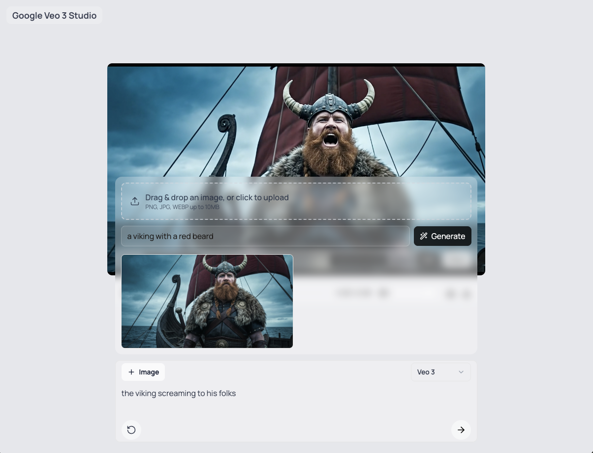

# Veo 3 Gemini API Studio Quickstart

[Veo 3](https://ai.google.dev/gemini-api/docs/video) is Google's state-of-the-art video generation model available in the Gemini API. This repository is a quickstart that demonstrates how to build a simple UI to generate videos with Veo 3, play them, and download the results. It also includes an image + text to video generation using the [Imagen 4](https://ai.google.dev/gemini-api/docs/imagen) model.



> [!NOTE]  
> If you want a full studio, consider [Google's Flow](https://labs.google/fx/tools/flow) (a professional environment for Veo/Imagen). Use this repo as a lightweight quickstart to learn how to build your own UI that generates videos with Veo 3 via the Gemini API.

(This is not an official Google product.)

## Features

-   Generate videos from text prompts using the Veo-3 model.
-   Generate videos from images + text prompts using the Imagen 4.0 model or upload a starting image.
-   Play and download generated videos.
-   Cut videos directly in the browser to a specific time range.

## Getting Started: Development and Local Testing

Follow these steps to get the application running locally for development and testing.

**1. Prerequisites:**

-   Node.js and npm (or yarn/pnpm)
-   **`GEMINI_API_KEY`**: The application requires a [GEMINI API key](https://aistudio.google.com/app/apikey). Either create a `.env` file in the project root and add your API key: `GEMINI_API_KEY="YOUR_API_KEY"` or set the environment variable in your system.

> [!WARNING]  
> Google Veo 3 and Imagen 4 are both part of the Gemini API Paid tier. You will need to be on the paid tier to use these models.

**2. Install Dependencies:**

```bash
npm install
```

**3. Run Development Server:**

```bash
npm run dev
```

Open your browser and navigate to `http://localhost:3000` to see the application.

## Project Structure

The project is a standard Next.js application with the following key directories:

-   `app/`: Contains the main application logic, including the user interface and API routes.
    -   `api/`: API routes for generating videos and images, and checking operation status.
-   `components/`: Reusable React components used throughout the application.
-   `lib/`: Utility functions and schema definitions.
-   `public/`: Static assets.

## Official Docs and Resources

-   Gemini API docs: `https://ai.google.dev/gemini-api/docs`
-   Veo 3 Guide: `https://ai.google.dev/gemini-api/docs/video?example=dialogue`
-   Imagen 4 Guide: `https://ai.google.dev/gemini-api/docs/imagen`

## How it Works

The application uses the following API routes to interact with the Google models:

-   `app/api/veo/generate/route.ts`:  Handles video generation requests. It takes a text prompt as input and initiates a video generation operation with the Veo-3 model.
-   `app/api/veo/operation/route.ts`: Checks the status of a video generation operation.
-   `app/api/veo/download/route.ts`:  Downloads the generated video.
-   `app/api/imagen/generate/route.ts`: Handles image generation requests with the Imagen model.

## Technologies Used

-   [Next.js](https://nextjs.org/) - React framework for building the user interface.
-   [React](https://reactjs.org/) - JavaScript library for building user interfaces.
-   [Tailwind CSS](https://tailwindcss.com/) - For styling.
-   [Gemini API](https://ai.google.dev/gemini-api/docs) with Veo 3 - For video generation; Imagen - For image generation.

## Questions and feature requests

-   **Want a feature?** Please open an issue describing the use case and proposed behavior.

## License

This project is licensed under the Apache License 2.0.
