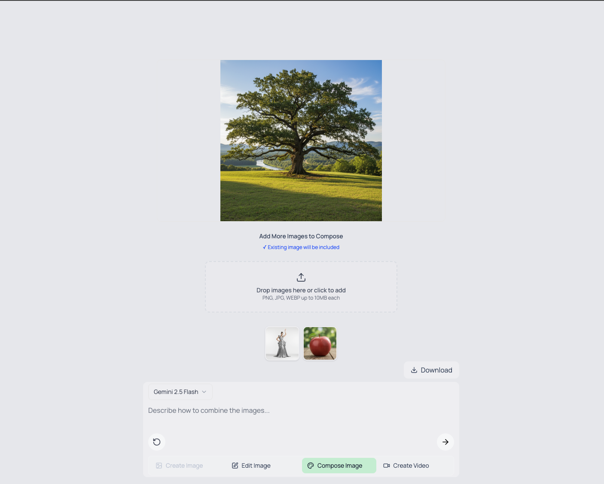
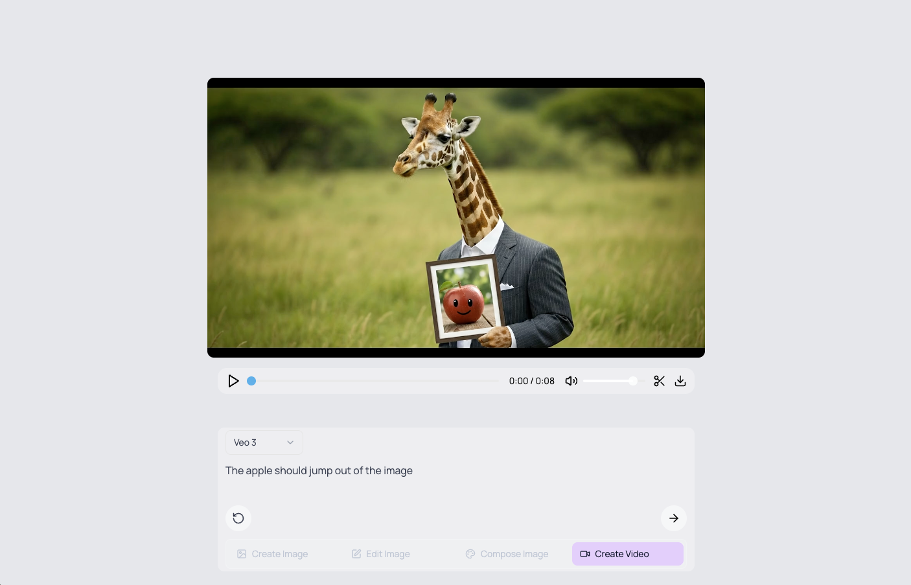

# Gemini API Veo 3 & Nano Banana Quickstart

A NextJs quickstart for creating and editing images and videos using Google's latest Gemini API models including [Veo 3](https://ai.google.dev/gemini-api/docs/video), [Imagen 4](https://ai.google.dev/gemini-api/docs/imagen), and [Gemini 2.5 Flash Image aka nano banana](https://ai.google.dev/gemini-api/docs/image-generations). 

<table>
  <tr>
    <td align="center">
      
      <br/>
      <strong>Compose</strong>
    </td>
    <td align="center">
      
      <br/>
      <strong>Edit</strong>
    </td>
    <td align="center">
      
      <br/>
      <strong>Video</strong>
    </td>
  </tr>
</table>

> [!NOTE]
> If you want a full studio, consider [Google's Flow](https://labs.google/fx/tools/flow) (a professional environment for Veo/Imagen). Use this repo as a lightweight studio to learn how to build your own UI that generates content with Google's AI models via the Gemini API.

(This is not an official Google product.)

## Features

The quickstart provides a unified composer UI with different modes for content creation:

-   **Create Image**: Generate images from text prompts using **Imagen 4** or **Gemini 2.5 Flash Image**.
-   **Edit Image**: Edit an image based on a text prompt using **Gemini 2.5 Flash Image**.
-   **Compose Image**: Combine multiple images with a text prompt to create a new image using **Gemini 2.5 Flash**.
-   **Create Video**: Generate videos from text prompts or an initial image using **Veo 3**.

### Quick Actions & UI Features
- Seamless navigation between modes after generating content
- Download generated images & videos
- Cut videos directly in the browser to specific time ranges


## Getting Started: Development and Local Testing

Follow these steps to get the application running locally for development and testing.

**1. Prerequisites:**

-   Node.js and npm (or yarn/pnpm)
-   **`GEMINI_API_KEY`**: The application requires a [GEMINI API key](https://aistudio.google.com/app/apikey). Either create a `.env` file in the project root and add your API key: `GEMINI_API_KEY="YOUR_API_KEY"` or set the environment variable in your system.

> [!WARNING]  
> Google Veo 3, Imagen 4, and Gemini 2.5 Flash are part of the Gemini API Paid tier. You will need to be on the paid tier to use these models.

**2. Install Dependencies:**

```bash
npm install
```

**3. Run Development Server:**

```bash
npm run dev
```

Open your browser and navigate to `http://localhost:3000` to see the application.

## Project Structure

The project is a standard Next.js application with the following key directories:

-   `app/`: Contains the main application logic and pages
    -   `page.tsx`: Main page with the unified composer UI.
    -   `api/`: API routes for different operations
        -   `imagen/generate/`: Image generation with Imagen 4
        -   `gemini/generate/`: Image generation with Gemini 2.5 Flash
        -   `gemini/edit/`: Image editing/composition with Gemini 2.5 Flash
        -   `veo/generate/`: Video generation operations
        -   `veo/operation/`: Check video generation status
        -   `veo/download/`: Download generated videos
-   `components/`: Reusable React components
    -   `ui/Composer.tsx`: The main unified composer for all interactions.
    -   `ui/VideoPlayer.tsx`: Video player with trimming
    -   `ui/ModelSelector.tsx`: Model selection component
    -   `ui/dropzone.tsx`: Drag-and-drop component for file uploads.
-   `lib/`: Utility functions and schema definitions
-   `public/`: Static assets

## Official Docs and Resources

-   Gemini API docs: `https://ai.google.dev/gemini-api/docs`
-   Veo 3 Guide: `https://ai.google.dev/gemini-api/docs/video?example=dialogue`
-   Imagen 4 Guide: `https://ai.google.dev/gemini-api/docs/imagen`

## How it Works

The application uses the following API routes to interact with the Google models:

### Image APIs
-   `app/api/imagen/generate/route.ts`: Handles image generation requests with Imagen 4
-   `app/api/gemini/generate/route.ts`: Handles image generation requests with Gemini 2.5 Flash
-   `app/api/gemini/edit/route.ts`: Handles image editing and composition with Gemini 2.5 Flash (supports multiple images)

### Video APIs
-   `app/api/veo/generate/route.ts`: Handles video generation requests with Veo 3
-   `app/api/veo/operation/route.ts`: Checks the status of video generation operations
-   `app/api/veo/download/route.ts`: Downloads generated videos

## Technologies Used

-   [Next.js](https://nextjs.org/) - React framework for building the user interface
-   [React](https://reactjs.org/) - JavaScript library for building user interfaces
-   [Tailwind CSS](https://tailwindcss.com/) - For styling
-   [Gemini API](https://ai.google.dev/gemini-api/docs) with:
  - **Veo 3** - For video generation
  - **Imagen 4** - For high-quality image generation
  - **Gemini 2.5 Flash** - For fast image generation, editing, and composition

## Questions and feature requests

-   **Want a feature?** Please open an issue describing the use case and proposed behavior.

## License

This project is licensed under the Apache License 2.0.
